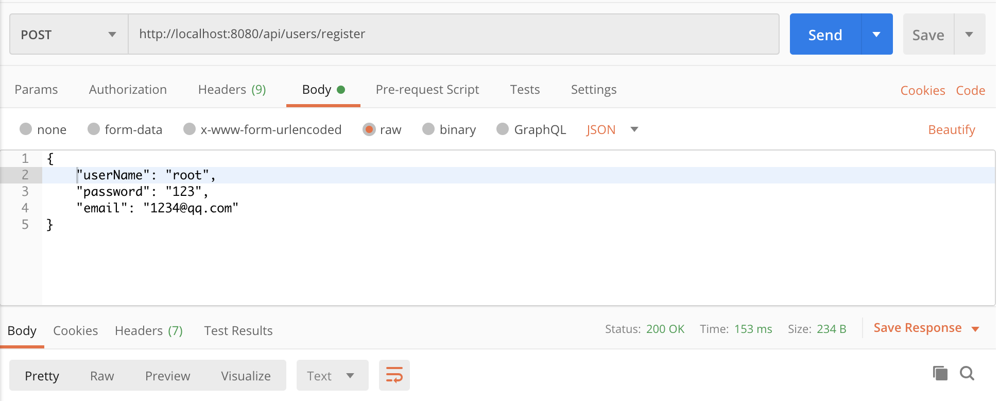
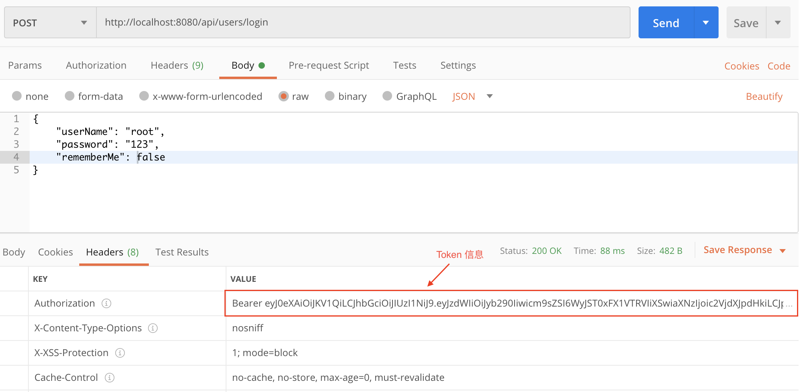
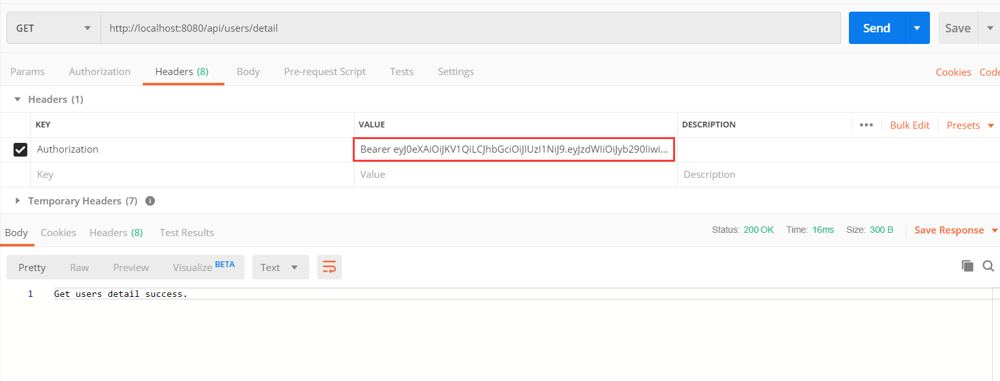
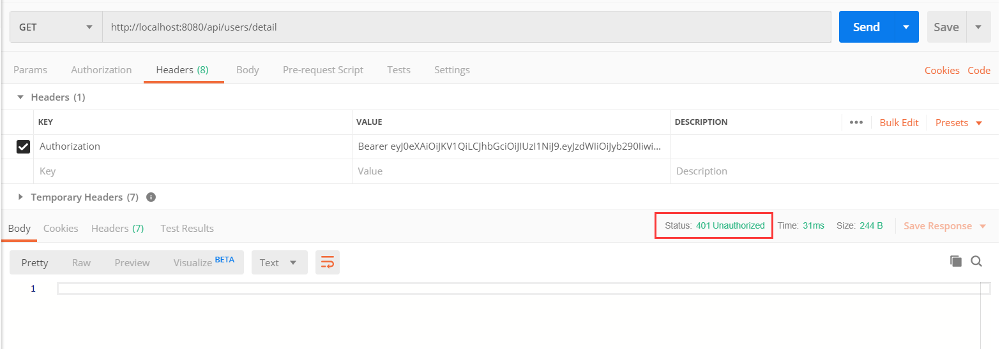
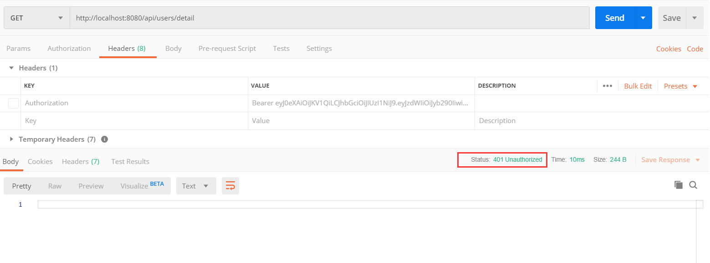

# spring security jwt  

### 概述

Spring Security 是 Spring 全家桶中一个功能强大且高度可定制的身份验证和访问控制框架。与所有 Spring 项目一样，我们可以轻松扩展 Spring Security 以满足自定义要求。 

由于 Spring Security 功能十分强大，相比于其他技术来说很难上手，很多刚接触 Spring Security 的开发者很难通过文档或者视频就能将其进行运用到实际开发中。

在公司实习的时候接触到的一个项目就使用了 Spring Security 这个强大的安全验证框架来完成用户的登录模块，并且也是自己负责的一个模块。当时自己对 Spring Security 基本不熟悉，可以说是第一次接触，查阅了很多关于这方面的资料，看得似懂非懂的，并且还在导师的指导下都花了将近一周的时间才勉强完成。

Spring Security 对于初学者来说，的确很难上手。于是自己在工作之余对这部分知识进行了学习，并实现了一个简单的项目，主要使用了 Spring Boot 技术集成 SPring Security 和 Spring Data Jpa 技术。这个项目实现的比较简单，还有很多地方需要优化，希望有兴趣的朋友可以一起完善，期待你的 PR。

### 项目下载
- git clone https://github.com/yifanzheng/spring-security-jwt.git 。

- 配置好 Maven 仓库，使用 IntelliJ IDEA 工具打开项目。

- 在 application.properties 配置文件中将数据信息改成你自己的。

### 测试 API

**注册账号**

**登录**

**带上正确的 token 访问需要身份验证的资源**  

  

**带上不正确的 token 访问需要身份验证的资源**

**不带 token 访问需要身份验证的资源** 

### 参考文档
- [https://www.callicoder.com/spring-boot-spring-security-jwt-mysql-react-app-part-2/
](https://www.callicoder.com/spring-boot-spring-security-jwt-mysql-react-app-part-2/
)
- [https://segmentfault.com/a/1190000009231329](https://segmentfault.com/a/1190000009231329)

- [https://www.springcloud.cc/spring-security.html](https://www.springcloud.cc/spring-security.html)