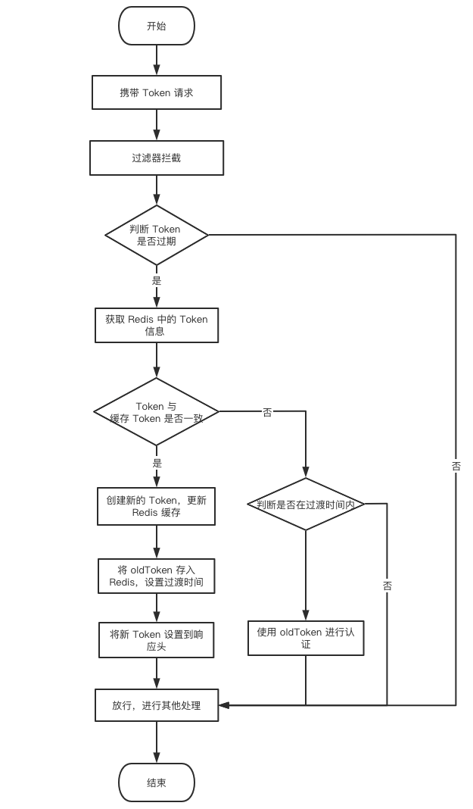

## 刷新 Token 的 Redis 方案

对 Token 进行刷新续期，我们要解决**并发请求导致重复刷新 Token** 的问题，这也是设计刷新 Token 的难点。

### 解决思路

当同一时间有多个请求时，第一个接口刷新了 Token，后面的请求仍然能通过请求，且不造成 Token 重复刷新。那么，后端在用户第一次登录时，需要将生成的 Token 数据（token 和 createTime）缓存一份到 Redis 中。

当 Token 过期时，重新生成新的 Token 数据并更新 Redis 缓存，同时在 Redis 中设置一条 Token 过渡数据并设置一个很短的过期时间（比如 30s）。如果后面的请求发现 Token 已经被刷新了，就判断 Redis 中是否存在 Token 过渡数据，存在就放行，这样同一时间的请求都可以通过。

### Token 刷新流程图

